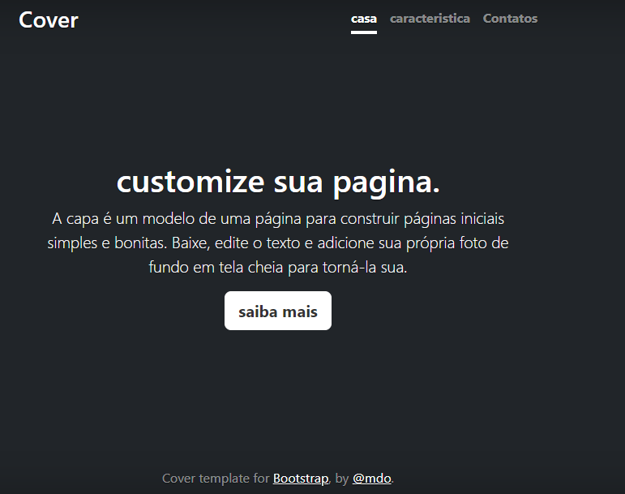

# indice
* [projeto escrita do README](#projeto-escrita-do-readme)

* [Descrição](#descri%C3%A7%C3%A3o)

* [Introdução](#introdu%C3%A7%C3%A3o)

* [Funcionalidades](#funcionalidades)

* [Tecnologias utilizadas](#tecnologias-utilizadas)

* [Fontes utilizadas ](#fontes-utilizadas)

* [Autores](#autores)

# projeto escrita do README

## descrição

## introdução

## funcionalidades

### tecnologias utilizadas

## fontes utilizadas

## autores